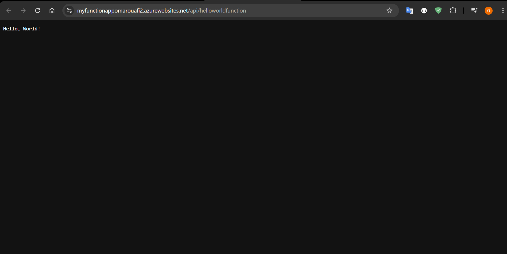
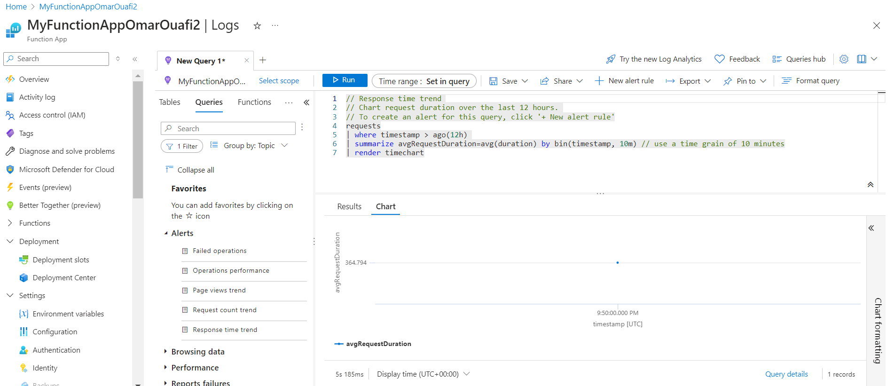

# Déploiement d'une Fonction Azure HTTP

Ce document résume les étapes que j'ai suivies pour créer et déployer une fonction HTTP sur Azure.

## Étapes

### 1. Création d'un projet Azure Function

J'ai créé un nouveau projet Azure Function en utilisant la commande suivante :

```bash
func init MyFunctionProj --python
```

### 2. Accès au projet
```bash
cd MyFunctionProj
```
### 3. Ajout de la fonction HelloWorld
```bash
func new --name HelloWorldFunction --template "HTTP trigger" --authlevel "anonymous"
```

### 4. Création de l'application Function dans Azure
```bash
az functionapp create --name MyFunctionApp --resource-group MyResourceGroup --plan MyPlan --runtime python --runtime-version 3.10 --functions-version 4 --storage-account MyStorageAccount
```

### 5. Publication de la fonction HelloWorld
```bash
func azure functionapp publish MyFunctionApp
```

