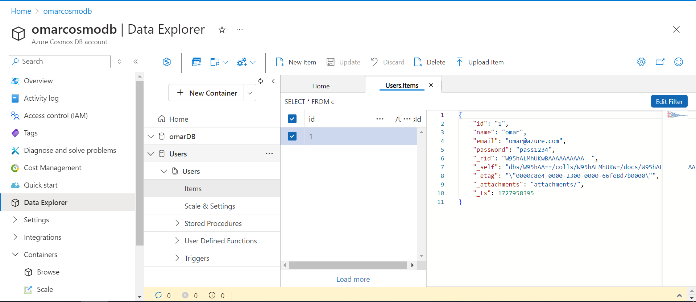
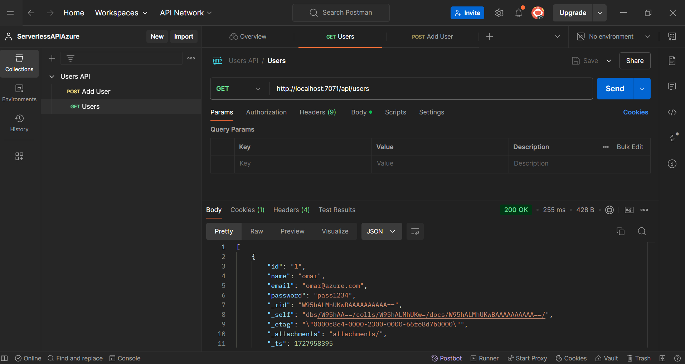

# API Serverless - Intégration avec Azure Cosmos DB

Ce document résume les étapes que j'ai suivies pour créer une API serverless sur Azure qui gère les opérations CRUD avec Azure Cosmos DB.

## Étapes

### 1. Création de l'application Function dans Azure

J'ai créé l'application Function dans Azure en utilisant la commande suivante :

```bash
az functionapp create --name MyFunctionApp --resource-group OmarResourceGroup2 --plan MyPlan --runtime python --runtime-version 3.10 --functions-version 4 --storage-account MyStorageAccount
```
### 2. Création de la fonction localement

J'ai créé la fonction localement qui inclut le code CRUD et les interactions avec la base de données en utilisant les commandes suivantes :

```bash
func init MyServerlessAPI --python
cd MyServerlessAPI
func new --name CRUDFunction --template "HTTP trigger" --authlevel "anonymous"
```
### 3. Création de la base de données Cosmos DB

J'ai créé la base de données Cosmos DB en utilisant les commandes suivantes :


```bash
az cosmosdb create --name $COSMOS_ACCOUNT_NAME --resource-group OmarResourceGroup2 --locations regionName=$REGION failoverPriority=0 --default-consistency-level "Session" --kind "GlobalDocumentDB"
az cosmosdb sql database create --account-name $COSMOS_ACCOUNT_NAME --resource-group OmarResourceGroup2 --name $DATABASE_NAME
az cosmosdb sql container create --account-name $COSMOS_ACCOUNT_NAME --database-name $DATABASE_NAME --name $CONTAINER_NAME --partition-key-path "/id" --throughput 400
```



### 4. Ajout de la chaîne de connexion
J'ai ajouté la chaîne de connexion à la fonction locale et l'ai testée en local.

### 5. Publication de la fonction sur Azure

```bash
func azure functionapp publish MyFunctionApp
```



