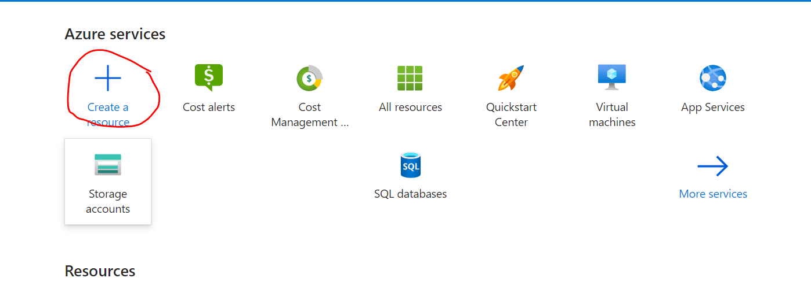
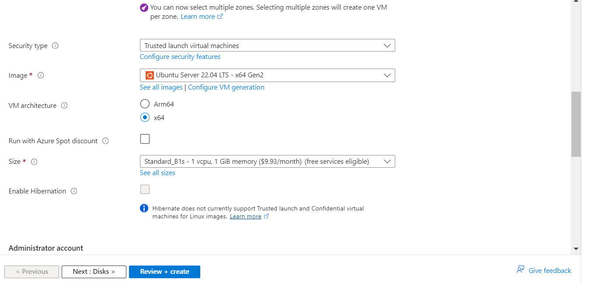
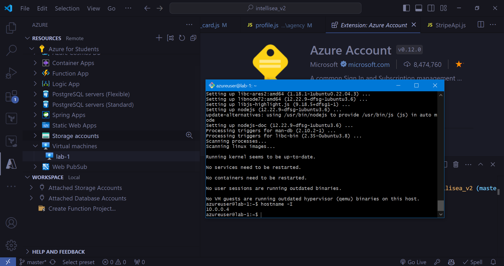
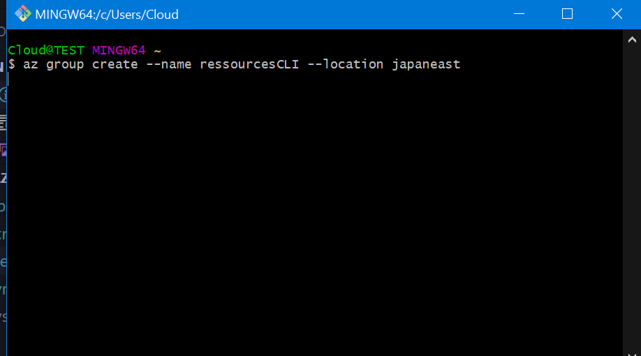

# Création d'une VM Ubuntu sur Azure

## Étapes pour créer ma VM Ubuntu en interface Azure

1. **Connexion au portail Azure**  
    - Je me rends sur le [portail Azure](https://portal.azure.com) et je me connecte.

2. **Créer une nouvelle ressource**  
    - Je clique sur "Créer une ressource".  
    - Ensuite, je sélectionne "Machines virtuelles".
    

3. **Configurer les paramètres de base**  
    - Je choisis mon abonnement et mon groupe de ressources.  
    - Je donne un nom à ma VM.  
    - Pour la "Région" j'ai choisi "Japan East".  
    - Pour l'"Image", je sélectionne "Ubuntu Server".  
    - Pour la taille j'ai choisi une machine avec 1 GB RAM et 1 CPU.
    

4. **Configurer l'authentification**  
    - Je sélectionne un "azureuser" et choisis "Clé SSH" pour l'authentification.  
    - Je génère ma clé publique SSH directement dans Azure.


5. **Examiner et créer**  
    - Je passe en revue toutes les configurations.  
    - Enfin, je clique sur "Créer" pour lancer le déploiement de ma VM.

6. **Accéder à la VM**  
    - Une fois la VM déployée, j'utilise SSH pour me connecter à ma VM Ubuntu.
    
```sh
ssh -i lab-1_key.pem azureuser@74.226.193.214
```

---

## Étapes pour créer ma VM Ubuntu avec Azure CLI

1. **Connexion à Azure CLI**  
    Je m'assure d'être connecté à Azure CLI en exécutant la commande suivante dans mon terminal :
    ```sh
    az login
    ```

2. **Création d'un groupe de ressources**  
    Je crée un groupe de ressources pour ma VM :
    ```sh
    az group create --name ressourcesCLI --location japaneast
    ```
    

3. **Création de la VM Ubuntu**  
    Je crée ma VM en utilisant la commande suivante, en spécifiant l'image Ubuntu et la taille de la VM :
    ```sh
    az vm create \
      --resource-group ressourcesCLI \
      --name Lab1CLI \
      --image Ubuntu2204 \
      --size Standard_B1s \
      --admin-username azureuser \
      --generate-ssh-keys \
      --location japaneast
    ```

4. **Ouverture du port SSH**  
    J'ouvre le port 22 pour permettre les connexions SSH à la VM :
    ```sh
    az vm open-port --port 22 --resource-group ressourcesCLI --name Lab1CLI
    ```

5. **Connexion à la VM via SSH**  
    Une fois la VM créée, je me connecte avec la commande suivante (en remplaçant l'adresse IP publique par celle générée) :
    ```sh
    ssh azureuser@48.218.25.153
    ```

6. **Vérification de la configuration**  
    Je peux vérifier les détails de ma VM avec la commande suivante :
    ```sh
    az vm show --resource-group ressourcesCLI --name Lab1CLI --show-details --output table
    ```
    
