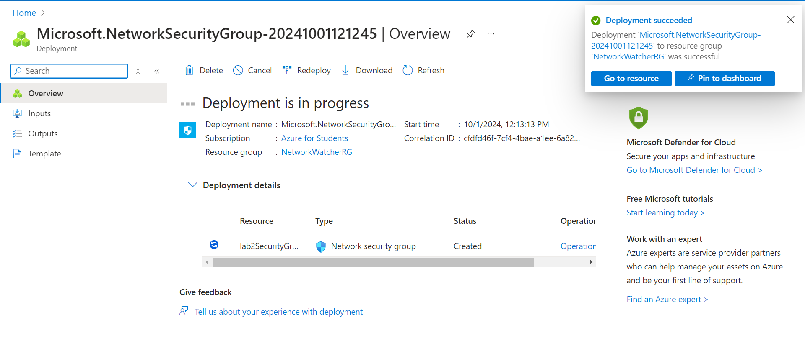

# Lab 2 : Mise en œuvre des réseaux virtuels Azure

## Étapes pour créer un réseau virtuel (VNet) avec plusieurs sous-réseaux

### 1. Créer un Réseau Virtuel (VNet) avec plusieurs sous-réseaux

#### Utilisation de l'interface Azure

1. **Accéder au portail Azure**  
   - Je me rends sur le [portail Azure](https://portal.azure.com) et je me connecte.

2. **Créer un réseau virtuel**  
   - Je clique sur "Créer une ressource".  
   - Je sélectionne "Réseau virtuel".  
   - Je configure les paramètres suivants :
     - **Nom** : `Lab2Vnet`
     - **Espace d'adresses** : `10.0.0.0/16`
   
     - **Sous-réseau 1** : `10.0.1.0/24` (Nom : `Default2`)
     - **Sous-réseau 2** : `10.0.2.0/24` (Nom : `Subnet2`)
   

### 2. Créer un Groupe de Sécurité Réseau (NSG)

#### Utilisation de l'interface Azure

1. **Créer un NSG**  
   - Je clique sur "Créer une ressource".  
   - Je cherche et sélectionne "Groupe de sécurité réseau".  
   - Je configure les paramètres suivants :
     - **Nom** : `MonNSG`
     - **Groupe de ressources** : `student`
     - **Région** : `Japan East`
   - Je clique sur "Créer".
   
   

### 2. Créer une machine virtuelle dans un sous-réseau

1. **Créer une ressource**  
   - Je clique sur "Créer une ressource" dans le menu de gauche.

2. **Sélectionner une machine virtuelle**  
   - Je cherche et sélectionne "Machines virtuelles".

### 3. Configurer les paramètres de la VM

1. **Choisir une image**  
   - Dans l'onglet "Détails de la machine virtuelle", je sélectionne :
     - **Nom** : `NomDeMaVM` (je choisis un nom significatif)
     - **Région** : `Japan East` (ou une région de mon choix)
     - **Image** : `Ubuntu Server` (je sélectionne l'image Ubuntu standard)
     - **Taille** : Je choisis une machine standard (par exemple, `Standard_DS1_v2`) selon mes besoins.
   

2. **Configurer l'authentification**  
   - Je sélectionne un nom d'utilisateur (par exemple, `azureuser`).
   - Je choisis "Clé SSH" comme méthode d'authentification pour plus de sécurité.
   - Je génère une nouvelle clé SSH si nécessaire.

### 4. Configurer les paramètres réseau

1. **Sélectionner le sous-réseau**  
   - Dans l'onglet "Réseau", je choisis :
     - **Réseau virtuel** : `MonVNet` (ou le réseau virtuel approprié)
     - **Sous-réseau** : Je sélectionne le sous-réseau (`Lab2Vnet/default2`).
    

## Configuration du peering VNet

### 1. Accéder à Lab2Vnet

1. **Trouver le réseau virtuel**  
   - Je clique sur "Réseaux virtuels" dans le menu de gauche.
   - Je sélectionne `Lab2Vnet2NoOverlap`.

### 2. Ajouter le peering

1. **Ajouter un peering**  
   - Dans le menu de gauche, je clique sur "Peering".
   - Je clique sur "+ Ajouter" pour créer un nouveau peering.

2. **Configurer les paramètres de peering**  
   - Je remplis les informations suivantes :
     - **Nom** : `Vnet2PeerintVnet1` (ou un nom significatif)
     - **Réseau virtuel à peering** : Je sélectionne ` Lab2Vnet`.
     - **Configuration de la connexion** : 
       - Je m'assure que les options de connexion sont configurées selon mes besoins, par exemple, en permettant le trafic entre les deux VNets.
   - Je clique sur "OK" pour enregistrer le peering.

Avec ces étapes, j'ai configuré un peering entre `Lab2Vnet` (10.0.0.0/16) et `Lab2Vnet2NoOverlap` (10.2.0.0/16), permettant ainsi une communication entre les deux réseaux virtuels.

