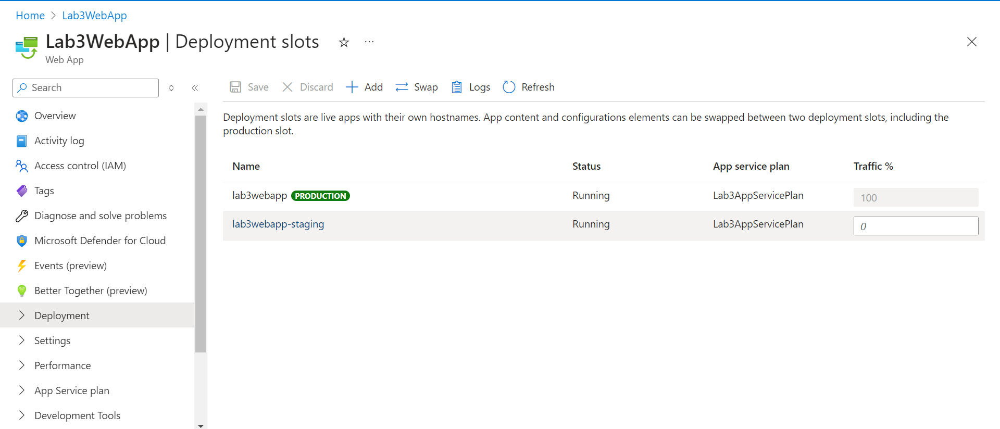

# Lab 3: Déploiement d'Applications Web Azure App Service

## Étapes :

- J'ai créé un nouveau Plan App Service nommé `Lab3AppServicePlan` dans la région **Japan East**.

- J'ai créé une application web nommée `Lab3WebApp` attachée au plan `Lab3AppServicePlan`.

- J'ai ajouté un domaine personnalisé `az.omarouafi.com` en ajoutant les enregistrements CNAME et TXT à mon fournisseur de domaine.

- J'ai ajouté un certificat SSL.

- J'ai ajouté un slot de déploiement nommé **staging**, en clonant les paramètres de `Lab3WebApp`.

