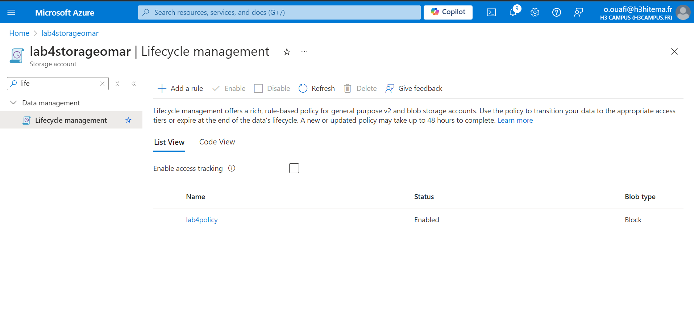
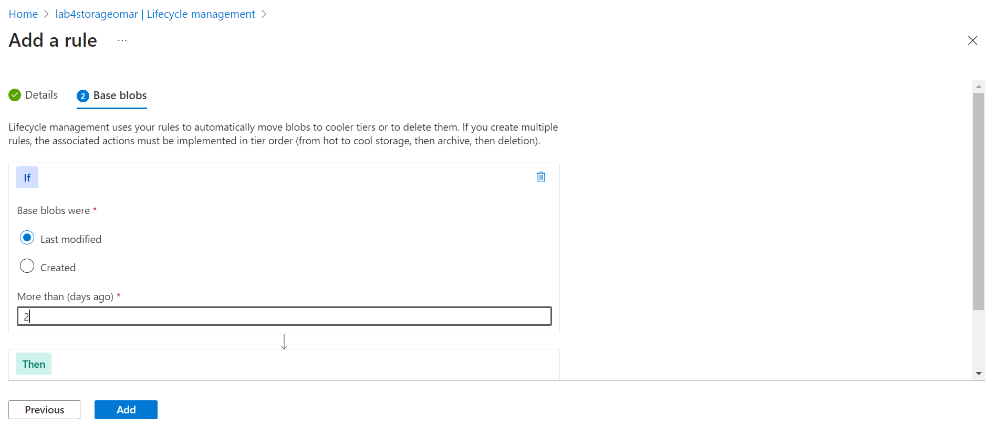

# Lab 4: Gestion des Comptes de Stockage Azure et des Blobs

## Étapes :

1. **Création d'un Compte de Stockage avec Option Géo-redondante**  
   - J'ai créé un compte de stockage avec l'option de **redondance géographique** (GRS) pour garantir la haute disponibilité et la durabilité des données dans différentes régions.

   
   
2. **Téléchargement d'un Fichier (Blob) dans un Conteneur**  
   - J'ai créé un conteneur dans mon compte de stockage.
   - Ensuite, j'ai téléversé un fichier dans ce conteneur pour stocker le blob.

   


3. **Configuration d'une Signature d'Accès Partagé (SAS)**  
   - J'ai généré une **Signature d'Accès Partagé (SAS)** pour accorder un accès sécurisé et limité à mon blob.
   - Cela permet de partager l'accès aux fichiers pour une durée et des permissions spécifiques.

   
   


4. **Implémentation des Politiques de Gestion du Cycle de Vie**  
   - J'ai mis en place des **politiques de gestion du cycle de vie** pour optimiser le stockage des blobs.

   
   


# Lab 4: Gestion des Comptes de Stockage Azure et des Blobs

## Étapes avec l'interface CLI :

1. **Création d'un Compte de Stockage avec Option Géo-redondante (CLI)**  
   - Pour créer un compte de stockage avec l'option **redondance géographique** (GRS), utilisez la commande suivante :
   
   ```bash
   az storage account create \
     --name lab4storageomar \
     --resource-group student \
     --location japaneast \
     --sku Standard_GRS \
     --kind StorageV2
     ```