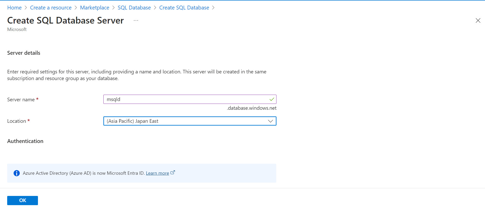
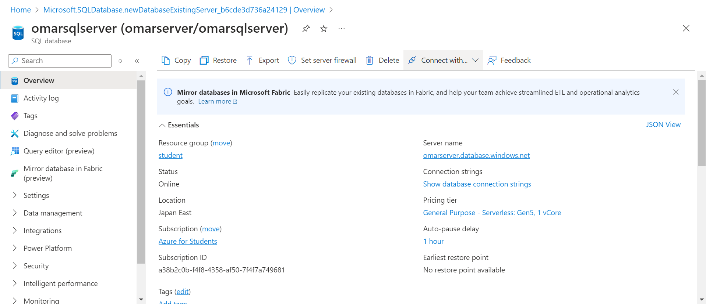
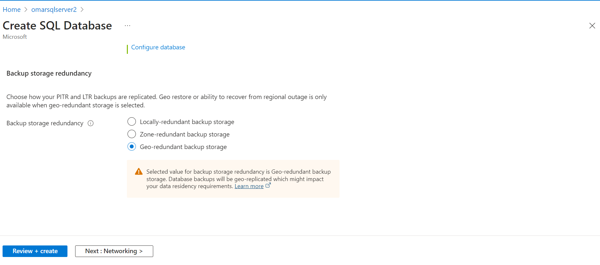
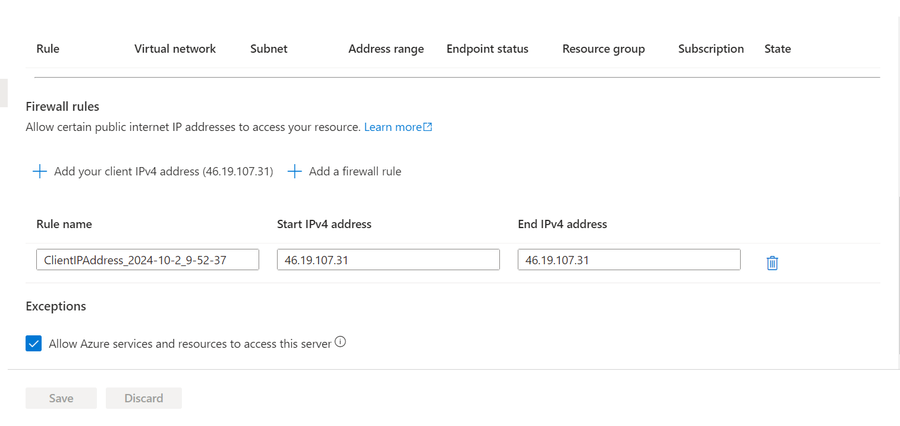
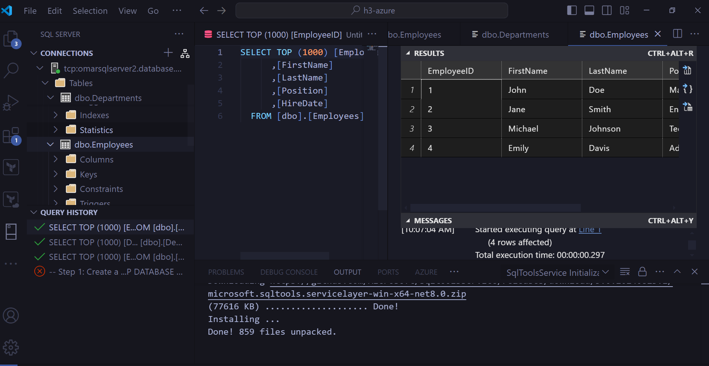
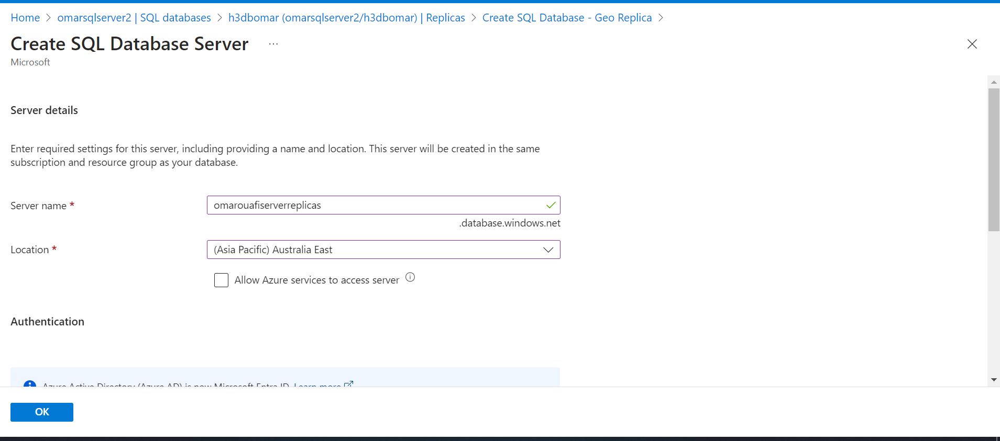

# Lab 5: Implémentation de Bases de Données SQL Azure

## Étapes avec l'interface Azure :

1. **Déploiement d'une instance de Base de Données SQL Azure**  
   - Je me rends sur le portail Azure et je clique sur **Créer une ressource**.  
   - Je sélectionne **Base de données SQL** et je crée un nouveau serveur SQL avec l'option d'authentification SQL.  
   - Le serveur est déployé dans la région **Japan East**.  
   - Je configure le nom d'administrateur et le mot de passe pour l'authentification SQL.  
   
   

2. **Création de la Base de Données**  
   - J'attache une nouvelle base de données à ce serveur SQL.  
   - Je choisis la configuration par défaut pour la taille de la base de données avec l'option S0 pour les objectifs de service.  
   

3. **Configuration des Paramètres du Pare-feu**  
   - Je configure les paramètres du pare-feu pour autoriser l'accès à partir d'adresses IP externes.  
   - J'ajoute une règle de pare-feu pour permettre l'accès à mon adresse IP.  
   

4. **Connexion à la Base de Données et Importation de Données**  
   - Je me connecte à la base de données à partir de **Visual Studio Code**.  
   - Je configure la connexion à la base de données avec les identifiants SQL définis lors de la création du serveur.  
   - J'importe des données de test dans la base de données à partir de mon fichier local.  
   

5. **Implémentation de la Géoréplication pour Haute Disponibilité**  
   - J'ajoute une réplication de la base de données dans la région **Australia East** pour garantir la haute disponibilité.  
   - Je choisis l'option de **géo-réplication** et je spécifie le serveur SQL cible dans la région Australia East.  
   

# Lab 5: Implémentation de Bases de Données SQL Azure

## Étapes avec l'interface CLI :

1. **Déploiement d'une instance de Base de Données SQL Azure (CLI)**  
   - J'ai créé un serveur SQL Azure avec l'option d'authentification SQL dans la région **Japan East** en utilisant la commande suivante :

   ```bash
    az sql server create \
        --name omarouafidb \
        --resource-group student \
        --location japaneast \
        --admin-user omarouafi \
        --admin-password Test1234
    ```