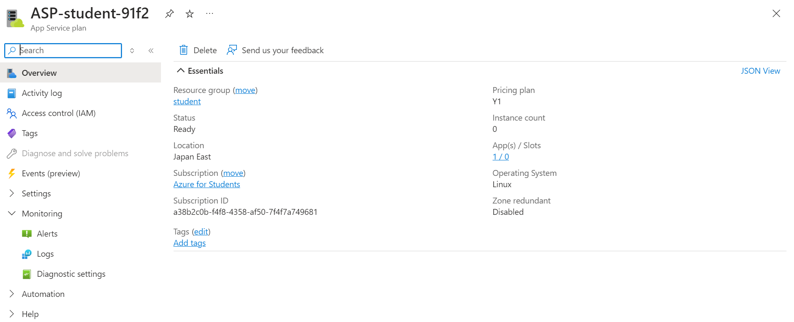

# Lab 7: Implémentation d'Azure Functions

## Étapes :

1. **Création d'une Azure Function App**
   - J'ai créé une **Function App** sur Azure pour déployer un environnement serveurless.
   - Pour cela, j'ai utilisé les étapes suivantes dans le portail Azure :
     - Aller sur **Créer une ressource**.
     - Sélectionner **Function App**.
     - Remplir les informations nécessaires : nom de l'application, groupe de ressources, runtime stack Node.js, et région (Japan East).
     - J'ai ensuite cliqué sur **Créer**.

   

2. **Création d'un Http Trigger**
   - Après avoir créé l'Azure Function App, j'ai ajouté une fonction déclenchée par une requête HTTP.
   - Voici les étapes suivies :
     - Dans la Function App, je suis allé dans la section **Functions**.
     - J'ai cliqué sur **Créer** et choisi le modèle **Http trigger**.
     - J'ai nommé la fonction `HttpTriggerFunction`.
     - J'ai sélectionné le niveau d'autorisation comme **Anonymous**.
     - Enfin, j'ai cliqué sur **Créer**.

   

3. **Création d'un Queue Trigger**
   - Ensuite, j'ai ajouté une fonction déclenchée par une file d'attente Azure (Azure Queue).
   - Les étapes :
     - Dans la Function App, j'ai cliqué sur **Ajouter** une nouvelle fonction.
     - J'ai sélectionné le modèle **Queue trigger**.
     - J'ai nommé la fonction `QueueTriggerFunction`.
     - J'ai configuré la connexion à mon compte de stockage Azure.

   

4. **Surveillance de la Fonction**
   - Pour surveiller les performances de mes fonctions, je suis allé dans la section **Monitor** de la Function App.

   


# Lab 7: Implémentation d'Azure Functions avec CLI

## Étapes :

1. **Création d'une Azure Function App**

   J'ai créé une **Azure Function App** avec le runtime **Node.js** en utilisant Azure CLI avec les commandes suivantes :

   ```bash
    az group create --name Lab7ResourceGroup --location japaneast

    az storage account create --name lab7storageaccount --location japaneast    --resource-group Lab7ResourceGroup --sku Standard_LRS

    az functionapp create --resource-group Lab7ResourceGroup --consumption-plan-location japaneast --runtime node --name Lab7FunctionApp --storage-account lab7storageaccount
    ```

2. **Création d'un Http Trigger**

    ```bash
    func init Lab7FunctionApp --worker-runtime node

    func new --name HttpTriggerFunction --template "HTTP trigger" --authlevel "anonymous"

    func azure functionapp publish Lab7FunctionApp
    ```

3. **Création d'un Queue Trigger**

    ```bash
    func new --name QueueTriggerFunction --template "Azure Queue Storage trigger"
    ```
    
    ```bash
    az functionapp config appsettings set --name Lab7FunctionApp --resource-group Lab7ResourceGroup --settings AzureWebJobsStorage="ChaîneDeConnexion"
    ```
    ```bash
        func azure functionapp publish Lab7FunctionApp
    ```
4. **Surveillance de la Fonction**
    ```bash
        func azure functionapp logstream Lab7FunctionApp
    ```
    ```bash
        az monitor metrics list --resource /subscriptions/SubscriptionID/resourceGroups/Lab7ResourceGroup/providers/Microsoft.Web/sites/Lab7FunctionApp --metric Requests

    ```
    ```bash
        az monitor app-insights component create --app Lab7AppInsights --location japaneast --resource-group Lab7ResourceGroup
    ```