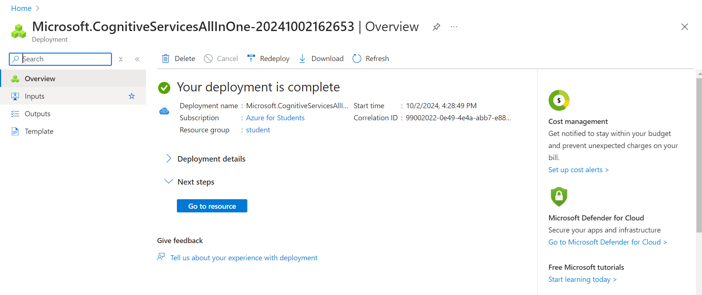
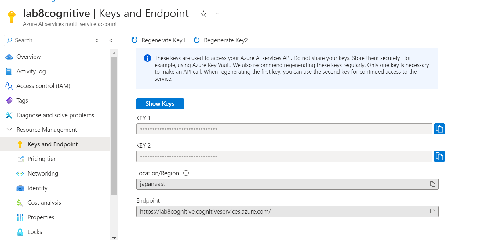
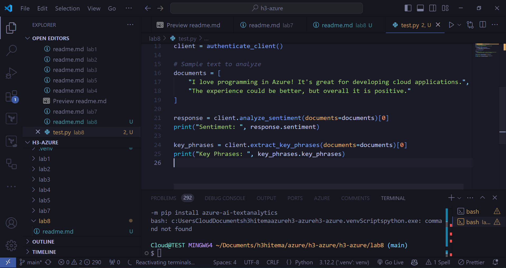
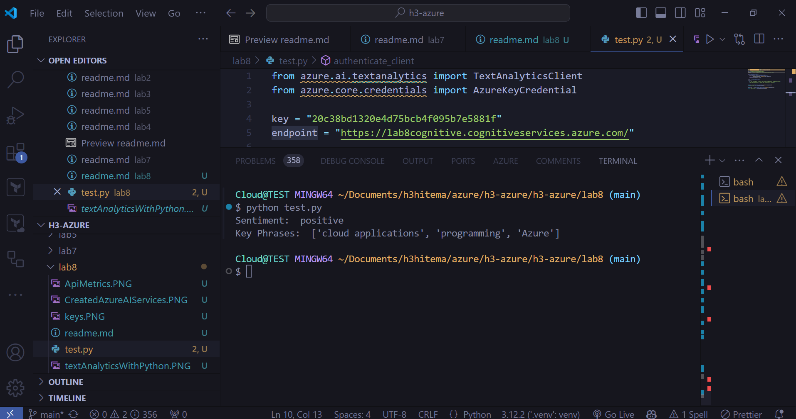
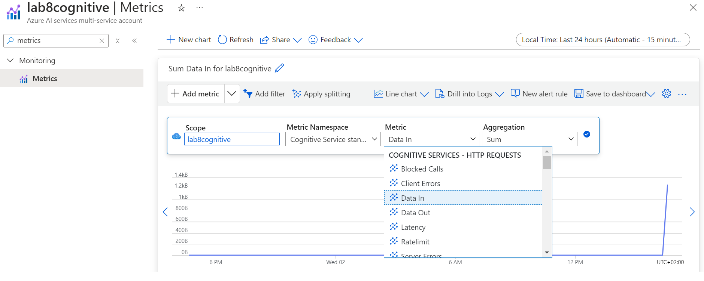

# Azure Cognitive Services - Laboratoire d'Analyse de Texte

## 1. Création d'un service d'IA sur Azure
J'ai créé une ressource **Cognitive Services** sur Azure afin d'utiliser l'API **Text Analytics**. Ce service permet de réaliser diverses tâches d'IA, telles que l'analyse des sentiments et l'extraction de phrases clés.



## 2. Récupération des clés API et de l'endpoint
Après avoir créé la ressource Cognitive Services, j'ai récupéré les informations nécessaires pour authentifier et interagir avec l'API :
- **Clé API**
- **Endpoint**



Ces informations sont disponibles dans la section **Clés et Endpoint** de la ressource Cognitive Services dans le portail Azure.

## 3. Création d'un fichier Python de test pour consommer l'API
Pour tester l'API, j'ai écrit un script Python qui s'authentifie à l'aide de la clé et de l'endpoint, puis envoie des requêtes à l'API.

## 4. Analyse de texte à partir de l'API d'IA
J'ai soumis un texte à analyser et récupéré les résultats d'analyse des sentiments et des phrases clés depuis l'API Text Analytics.


## 5. Suivi de l'utilisation de l'API dans Azure Metrics
J'ai surveillé l'utilisation de l'API dans Azure en accédant à la section **Metrics** de la ressource Cognitive Services. Cela m'a permis de suivre l'utilisation des ressources et les performances de l'API.


# Azure Cognitive Services - Text Analytics Lab (CLI)

## 1. Created AI Services in Azure using Azure CLI
I used the Azure CLI to create a **Cognitive Services** resource for the **Text Analytics API**. The command used is as follows:

```bash
az cognitiveservices account create \
  --name <YourServiceName> \
  --resource-group student \
  --kind TextAnalytics \
  --sku S \
  --location <Region> \
  --yes
  ```

## 2. Collected API Keys and Endpoint using Azure CLI

```bash
    az cognitiveservices account keys list \
    --name omarouafiservice \
    --resource-group student
```

## 3. Monitored API Usage in Azure Metrics via CLI

```bash
az monitor metrics list \
  --resource omarouafi \
  --metric "TotalCalls"
```
