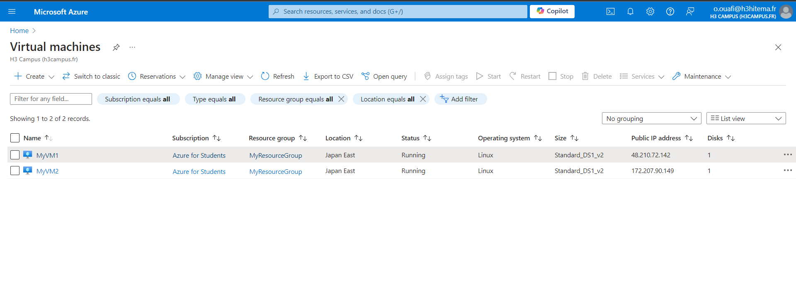
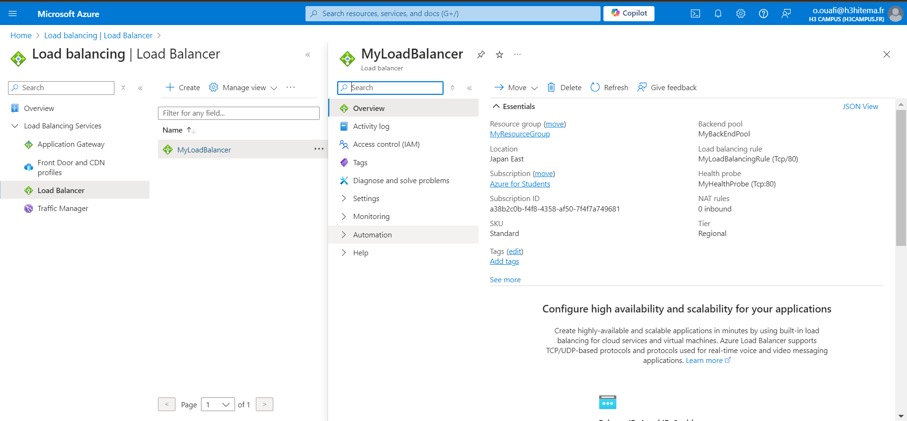

# Lab 9 : Mise en œuvre d'un équilibrage de charge Azure et du Traffic Manager

## Étapes

### Étape 1 : Créer un réseau virtuel (VNet)
1. Création d'un réseau virtuel pour permettre la connectivité des ressources.
2. Vérification que le VNet supporte plusieurs machines virtuelles avec une plage d'adresses appropriée.

#### Commande CLI
```bash
az network vnet create \
  --name MonReseauVirtuel \
  --resource-group MonGroupeDeRessources \
  --address-prefix 10.0.0.0/16 \
  --subnet-name MonSubnet \
  --subnet-prefix 10.0.1.0/24 \
  --location japaneast
```


### Étape 2 : Créer les machines virtuelles (VMs)

```bash
for i in 1 2; do
  az vm create \
    --resource-group MonGroupeDeRessources \
    --name MonVM$i \
    --image UbuntuLTS \
    --vnet-name MonReseauVirtuel \
    --subnet MonSubnet \
    --admin-username azureuser \
    --admin-password MonMotDePasseSecurise123! \
    --location japaneast
done
```

### Étape 3 : Créer une adresse IP publique

```bash
az network public-ip create \
  --resource-group MonGroupeDeRessources \
  --name MonIPPublique \
  --allocation-method Static \
  --location japaneast
  ```


### Étape 4 : Load balancer

```bash
az network lb create \
  --resource-group MonGroupeDeRessources \
  --name MonEquilibreurDeCharge \
  --frontend-ip-name MonFrontEnd \
  --backend-pool-name MonPoolBackEnd \
  --public-ip-address MonIPPublique \
  --location japaneast

az network lb probe create \
  --resource-group MonGroupeDeRessources \
  --lb-name MonEquilibreurDeCharge \
  --name MaSondeDeSante \
  --protocol tcp \
  --port 80

az network lb rule create \
  --resource-group MonGroupeDeRessources \
  --lb-name MonEquilibreurDeCharge \
  --name MaRegleEquilibrage \
  --protocol tcp \
  --frontend-port 80 \
  --backend-port 80 \
  --frontend-ip-name MonFrontEnd \
  --backend-pool-name MonPoolBackEnd \
  --probe-name MaSondeDeSante

for i in 1 2; do
  az network nic ip-config address-pool add \
    --resource-group MonGroupeDeRessources \
    --nic-name MonVM$i'VMNic' \
    --lb-name MonEquilibreurDeCharge \
    --address-pool MonPoolBackEnd \
    --ip-config-name ipconfig1
done

```


